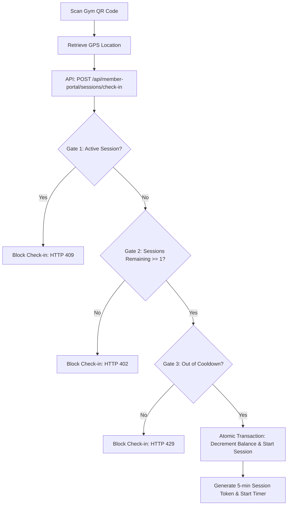

# Gym CRM Developer & Teammate Implementation Guide

Welcome to the **Gym CRM & FitPass (FitPrime)** repository! This guide provides everything a teammate needs to understand the current architecture, how features are implemented (specifically the completed FitPass session system), security/authentication mechanisms, testing credentials, and how to update and expand the application with new gym features.

---

## 1. Project Overview & Repository Structure

The Gym CRM is a multi-tenant platform that connects a centralized session-based network (**FitPass / FitPrime**) with individual **Partner Gyms**. 
* **FitPass (FitPrime)** allows members to purchase packages of *sessions* (global plans) and scan QR codes to work out at any partner gym.
* **Partner Gyms** manage their own traditional memberships, branch staff, expenses, payroll, class timetables, gym equipment, and member assessments.

### Codebase Organization

The repository is structured into three main projects:
1. **`backend/`**: Express API server managing the PostgreSQL database via Prisma, with a custom Mongoose compatibility adapter.
2. **`frontend/`**: Vite + React Web App used by Super Admins to manage partner gyms/plans, and by Gym Admins/Receptionists for daily operations.
3. **`Mobile/`**: Expo React Native app used by gym members to browse gyms, buy plans, check in via QR, and view active workout timers.

---

## 2. Authentication & Security Flows

The application uses two distinct login systems based on user roles and client types.

### A. Web Admin / Superadmin Authentication (Password-Based)
* **Endpoints**: 
  * Login: `POST /api/auth/login` (handled by [authUser](file:///d:/Zippy/GYM-CRM/backend/controllers/authController.js#L221-L286))
* **How it works**:
  * Users provide their email and password.
  * To protect against brute-force attacks, the backend increments `failedLoginAttempts` on the `User` record.
  * **Lockout Policy**: After **5 failed attempts**, the account is locked for **15 minutes** (controlled by `lockUntil` in the database).
  * Admins (`superadmin`, `admin`, `partner`) skip email verification. Traditional members must be verified via OTP.
* **Rate Limiting**: Enforced via `authLimiter` middleware (5 login attempts per 15 minutes per IP).

### B. Mobile Member Authentication (OTP-Based)
* **Endpoints**:
  * Check User: `POST /api/auth/check-user` (handled by [checkUserAndSendOTP](file:///d:/Zippy/GYM-CRM/backend/controllers/authController.js#L291-L328))
  * Verify OTP: `POST /api/auth/verify-otp` (handled by [verifyOTP](file:///d:/Zippy/GYM-CRM/backend/controllers/authController.js#L121-L216))
* **How it works**:
  * The member enters their email on the login screen.
  * The backend checks if they exist. If they do, it issues a **6-digit cryptographically secure OTP** (generated using `crypto.randomInt` to avoid bias) and emails it to the user.
  * The OTP is salted and hashed using `bcrypt` and stored in the `OTP` database table.
  * **Brute-Force Lockout**: The OTP record tracks failed verify attempts. After **5 failed OTP validation attempts**, the OTP is destroyed, forcing the user to request a fresh OTP code.
  * **Expiry**: OTPs are valid for **10 minutes** (`OTP_TTL_MINUTES`).

---

## 3. FitPass (FitPrime) - Session Check-in System

The FitPass core feature allows members to check in at gyms using their session balance.

### Core Architecture & Gates
When a user scans a gym's QR code on the mobile app, the check-in is evaluated against **three strict gates** in [sessionHelpers.js](file:///d:/Zippy/GYM-CRM/backend/utils/sessionHelpers.js):

1. **Active Session Gate**: A member cannot check in if they already have a running workout session.
2. **Session Balance Gate**: A member must have `sessionsRemaining >= 1`.
3. **Cooldown Gate**: A member must wait for a global cooldown window of **3 hours** (`COOLDOWN_MS`) from the **END** of their last session before starting a new one.



### Lazy Expiry & Race-Condition Protection
* **Lazy Expiry (`expireIfDue`)**: Active sessions are expired on-the-fly whenever a member's plan or status is loaded. This bridges the gap between server cron jobs (which run periodically) and live user interaction, ensuring timers are accurate down to the millisecond.
* **Race-Safe Decrement (`attemptCheckIn`)**: Session deductions are processed inside a single Prisma `updateMany` command. The query is conditioned on `sessionsRemaining >= 1` and `currentSessionEndsAt = null`. This prevents double-tap check-in abuse (rapid clicks or network retries causing double session deductions).

---

## 4. Admin & User Testing Credentials

Below are the pre-configured database credentials for development and verification:

| Role | Username / Email | Password | Gym Context / Details |
| :--- | :--- | :--- | :--- |
| **Super Admin** | `superadmin@gymcrm.com` | `superpassword` | Manages the global system, registers new gyms, creates FitPrime plans. |
| **FitPrime Gym Admin** | `admin@fitprime.com` | `adminpassword123` | Admin for "Fitprime Gym" (partner gym). |
| **FitPrime Gym Member** | `user@fitprime.com` | `userpassword123` | Member registered at Fitprime Gym. Used for Mobile login checks. |

> [!WARNING]
> These credentials are seeded automatically via backend scripts. Do not use these exact passwords in production environments.

---

## 5. Database Schema & Mongoose Compatibility

The database is built on **PostgreSQL** using [Prisma](file:///d:/Zippy/GYM-CRM/backend/prisma/schema.prisma). Because the backend was originally designed for MongoDB/Mongoose, a custom compatibility wrapper [MongooseAdapter.js](file:///d:/Zippy/GYM-CRM/backend/models/MongooseAdapter.js) translates standard Mongoose query operators (`$or`, `$lt`, `$regex`, `$push`, `populate()`, `lean()`, `aggregate()`) into SQL-equivalent Prisma calls.

### Core Database Models
* **`Gym`**: Gym location data, address, phone, and `defaultSessionDurationMinutes` (controls how long a check-in session lasts).
* **`User`**: Admin/trainer account accounts with passwords, roles (`superadmin`, `admin`, `receptionist`, `trainer`, `member`), and login locks.
* **`Member`**: Core profiles containing membership statuses, join dates, plan IDs, and FitPass variables (`sessionsRemaining`, `sessionsTotal`, `currentSessionEndsAt`, `cooldownEndsAt`).
* **`SessionCheckIn`**: Historical log of every successful QR check-in event.
* **`Plan`**: Traditional time-based plans (e.g. 30 days) or SYSTEM plans (session-based for FitPass).
* **`Attendance`**: Local gym member attendance sheets.
* **`AuditLog`**: Security audits tracking logins, administrative adjustments, and sensitive actions.

---

## 6. Teammate Guide: How to Implement New Gym Features

To expand the application with local gym features (e.g., trainer assignments, equipment status, local class scheduling), follow this step-by-step implementation pattern.

### Step 1: Update the Prisma Schema
Add your new model to [schema.prisma](file:///d:/Zippy/GYM-CRM/backend/prisma/schema.prisma). Make sure to link it to a specific `Gym` using `gymId` for multi-tenant isolation.
```prisma
model GymEquipment {
  id           String   @id @default(uuid())
  name         String
  status       String   @default("Active") // Active, Broken
  gymId        String
  createdAt    DateTime @default(now())
  
  @@index([gymId])
}
```

### Step 2: Run Prisma Migrations
Generate and run the PostgreSQL migration:
```bash
npx prisma migrate dev --name add-gym-equipment
```

### Step 3: Create the Model Wrapper
Create a file inside `backend/models/` (e.g., `GymEquipment.js`):
```javascript
const { ModelWrapper } = require('./MongooseAdapter');
const GymEquipment = new ModelWrapper('gymEquipment'); // matches prisma model name in camelCase
module.exports = GymEquipment;
```

### Step 4: Write the Controller & Route
Add a controller in `backend/controllers/` (e.g., `equipmentController.js`). Implement **tenant isolation** by enforcing that records can only be queried or modified if their `gymId` matches the logged-in user's `gymId` (`req.user.gymId`).
```javascript
// Example Controller: Get local equipment list
const getEquipment = async (req, res) => {
    // Tenant isolation: req.user.gymId is injected by the protect middleware
    const items = await GymEquipment.find({ gymId: req.user.gymId });
    res.json(items);
};
```
Define your routes in `backend/routes/` and mount them in [server.js](file:///d:/Zippy/GYM-CRM/backend/server.js).

### Step 5: Implement Web UI and Mobile Views
* **Admin Web UI**: Add state managers and UI elements in `frontend/src/pages/`. Make sure to wrap access with `<ProtectedRoute roles={['admin']}>` and layout routers inside [App.jsx](file:///d:/Zippy/GYM-CRM/frontend/src/App.jsx).
* **Mobile Screen**: Add router endpoints inside `Mobile/src/app/(tabs)/` or roles-based routes like `Mobile/src/app/(admin)/` using Expo's file-based router.

---

## 7. How to Run, Test, and Update the App

### Environment Setup
Create a `.env` file in the `backend/` directory. You can copy the values from `.env.example`.
Key items to configure:
* `DATABASE_URL`: Connection string to the PostgreSQL database (e.g. Neon, local PG).
* `JWT_SECRET`: Generate using `node scripts/generateSecret.js`.
* `RAZORPAY_KEY_ID` & `RAZORPAY_KEY_SECRET`: Razorpay keys. (In development, if left blank or set to placeholders, the system falls back to **Mock Payment Mode** so you can purchase plans for free).
* `SMTP_HOST` & `SMTP_PASS`: Credentials for sending OTP login emails.

### Startup Commands

Run these commands in separate terminals:

1. **Start the Backend API**:
   ```bash
   cd backend
   npm install
   npm start # runs node server.js (reboot-guarded against placeholder secrets)
   ```
2. **Start the Web Admin Dashboard**:
   ```bash
   cd frontend
   npm install
   npm run dev # spins up Vite dev server on http://localhost:5173
   ```
3. **Start the Expo Mobile App**:
   ```bash
   cd Mobile
   npm install
   npx expo start # launches metro bundler. Scan QR on phone, or run android/ios commands
   ```

### Seeding Test Users
If you are resetting the database or starting fresh, you can run the following seed scripts in the `backend/` directory:
```bash
# Seed the Super Admin account (superadmin@gymcrm.com)
node createSuperAdmin.js

# Seed the FitPrime Gym and test admin/user accounts
node create-fitprime-users.js
```

---

*Happy Coding! For any questions regarding custom queries or MongooseAdapter, refer to the source at [MongooseAdapter.js](file:///d:/Zippy/GYM-CRM/backend/models/MongooseAdapter.js).*
