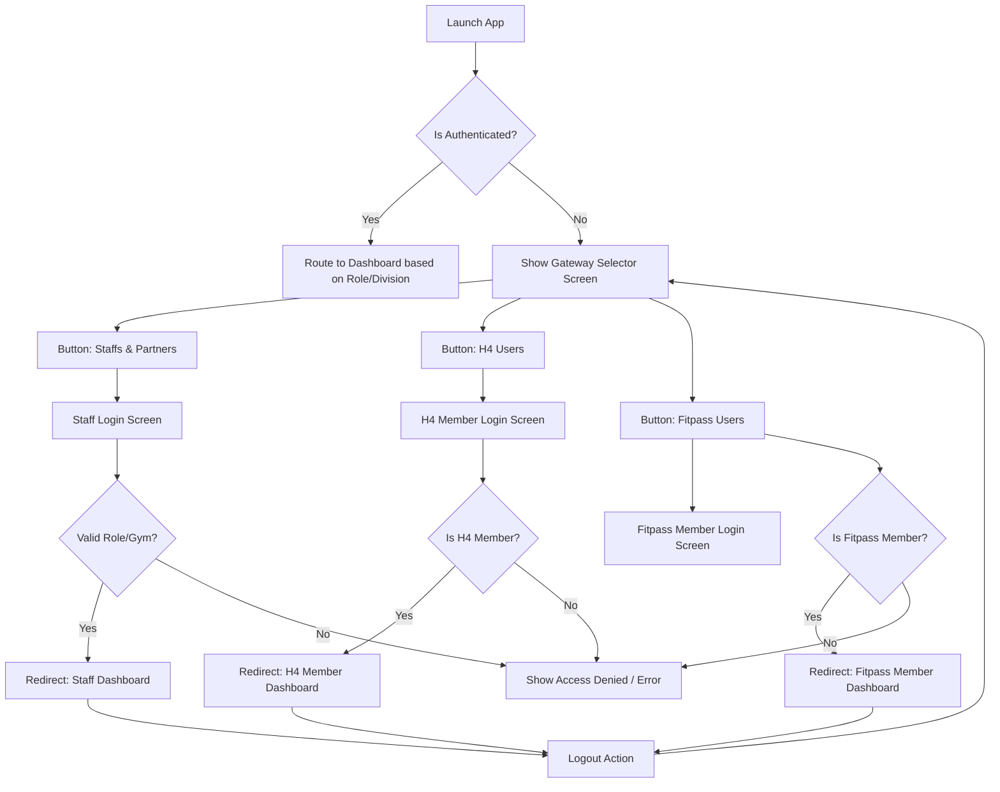

# App Gateway & Authentication Flow Specification

This document details the authentication and app entry architecture to partition the entry flow into three distinct channels before the login pages. It is modeled after the Ajio store-selector style gatekeeping.



---

## 1. Gateway Selector Screen (Pre-Login Screen)

When the user launches the app and is **not authenticated** (no token is found in the local storage), they are presented with a gateway selection screen.

### UX & Layout Design
- **Header**: Clear, high-end title (e.g., "Welcome to FitPrime & H4" or "Select Your Portal").
- **Portal Selection Cards**: Three prominent, visually rich cards (inspired by Ajio's layout style):
  1. **Staffs & Partners** (Clean corporate styling, icon: `ShieldCheck` or `Users`)
  2. **H4 Fitness Users** (H4 branded colors/visuals, icon: `Activity` or `Flame`)
  3. **Fitpass Users** (Fitpass branded styling, icon: `QrCode` or `Ticket`)
- **Action**: Clicking a card saves the selected portal choice to local state or passes it as a route parameter and navigates to the corresponding login screen.

---

## 2. Portal Channels & Verification Rules

Each channel has strict validation rules. If a user tries to log in using the wrong portal, they must be blocked with an explicit error message (e.g., *"Unauthorized portal access. Please select your correct login portal."*) and not granted a token.

### 2.1 Staffs & Partners Portal
This portal is designated for administrative, operational, and coaching staff.
*   **Allowed Roles**: 
    - `superadmin` (Super Admin Console)
    - `trainer` (Trainer / Coaching Staff)
    - `partner` (Gym/Organization Owner)
    - `admin` (Gym Branch Manager / General Admins)
*   **H4 Managers**: An H4 Manager is a user with role `admin` or `partner` whose `gymId` is associated with the **H4 Gym** (Gym name contains "H4"). They also login through this portal.
*   **Verification Rule**:
    ```typescript
    const isStaffOrPartner = ['superadmin', 'trainer', 'partner', 'admin'].includes(user.role);
    if (!isStaffOrPartner) {
        throw new Error("Access Denied: This portal is restricted to Staffs and Partners.");
    }
    ```
*   **Target Destination**: Staff & Partner Dashboard.

### 2.2 H4 Users Portal
This portal is designated exclusively for members of the H4 Fitness gyms.
*   **Allowed Roles**: `member` (regular members).
*   **Verification Rule**:
    - User's role must be `member`.
    - User's associated `gymId` must be the H4 Gym (Gym Name = `"H4"`).
    ```typescript
    const isH4Member = user.role === 'member' && user.gymName?.toUpperCase() === 'H4';
    if (!isH4Member) {
        throw new Error("Access Denied: This portal is restricted to H4 members only.");
    }
    ```
*   **Target Destination**: H4 Member Portal Dashboard.

### 2.3 Fitpass Users Portal
This portal is designated for general Fitpass/FitPrime session-based gym members.
*   **Allowed Roles**: `member` (regular members).
*   **Verification Rule**:
    - User's role must be `member`.
    - User's plan/gym must be part of the Fitpass ecosystem (i.e., NOT the H4 Gym).
    ```typescript
    const isFitpassMember = user.role === 'member' && user.gymName?.toUpperCase() !== 'H4';
    if (!isFitpassMember) {
        throw new Error("Access Denied: This portal is restricted to Fitpass members only.");
    }
    ```
*   **Target Destination**: Fitpass Member Portal Dashboard.

---

## 3. Detailed Component & Routing Changes

### 3.1 Navigation Guard & App Layout (`App-Code/app/_layout.tsx`)
Modify `NavigationGuard` to handle the new gateway selector screen:
- Introduce a check for a new route: `/landing` or `/gateway` (under `(auth)` group).
- If no token is found, replace route with `/(auth)/landing` instead of redirecting straight to `/(auth)/login`.
- If a token is found, automatically redirect the user to their appropriate dashboard:
  - If `role` is `superadmin` / `partner` / `admin` / `trainer` -> `/(superadmin)/dashboard`.
  - If `role` is `member` and gym is `H4` -> H4 Member Dashboard.
  - If `role` is `member` and gym is NOT `H4` -> Fitpass Member Dashboard.

### 3.2 Gateway Selector Screen (`App-Code/app/(auth)/landing.tsx`)
Create a new screen with three touch targets. On click, navigate to:
- `/login?portal=staff`
- `/login?portal=h4`
- `/login?portal=fitpass`

### 3.3 Auth Hook (`App-Code/src/features/auth/hooks/useAuth.ts`)
Update the `login` function to accept `portal` as a parameter and perform post-login validation:
```typescript
login: async (email, password, portal) => {
  const { data } = await API_CLIENT.post('/auth/login', { email, password });
  
  const userRole = data.role;
  const userGymName = data.gymName;

  if (portal === 'staff') {
    if (!['superadmin', 'trainer', 'partner', 'admin'].includes(userRole)) {
      throw new Error('Access Denied: This portal is restricted to Staffs and Partners.');
    }
  } else if (portal === 'h4') {
    if (userRole !== 'member' || userGymName?.toUpperCase() !== 'H4') {
      throw new Error('Access Denied: This portal is restricted to H4 Gym Members.');
    }
  } else if (portal === 'fitpass') {
    if (userRole !== 'member' || userGymName?.toUpperCase() === 'H4') {
      throw new Error('Access Denied: This portal is restricted to Fitpass Members.');
    }
  }

  // Save auth state, token, etc.
}
```

### 3.4 Logout Flow
The logout function in `useAuth.ts` will clear all saved values (including any portal state) and the `NavigationGuard` will redirect them back to `/(auth)/landing`.

---

## 4. Backend Authentication Endpoint Scope

While frontend validation is important for user experience, the backend should ideally enforce these restrictions for security.
- Add optional validation parameter in `POST /api/auth/login` (e.g., `portalType`).
- Validate that the user attempting to authenticate meets the portal constraints on the backend.

---

## 5. Warm Amber-Gold Theme Implementation Details

All user interface screens, components, and widgets must strictly follow the **Warm Amber-Gold Palette** to maintain a motivating, cohesive, and premium aesthetic:

- **Primary Brand Color**: `#F0A020` (Amber / Brand Gold) and `#D9860F` (Dark Amber / Gold)
- **Background**: `#231D14` (Very dark warm brown-black)
- **Card Background**: `#2D251C` (Dark warm brown)
- **Border Default**: `#3A3025` (Warm brown border)
- **Primary Text**: `#FFFFFF` (High-contrast white for headings/titles)
- **Secondary Body Text**: `#A39686` (Warm muted brown-gray for readability against amber highlights)
- **Muted Text**: `#6D6154` (Captions/details)
- **Semantic Colors**:
  - **Success**: `#2E7D32` (Active Pass - Green)
  - **Error**: `#C62828` (Expired Session - Red)
  - **Info**: `#1976D2` (Cooldown - Blue)

